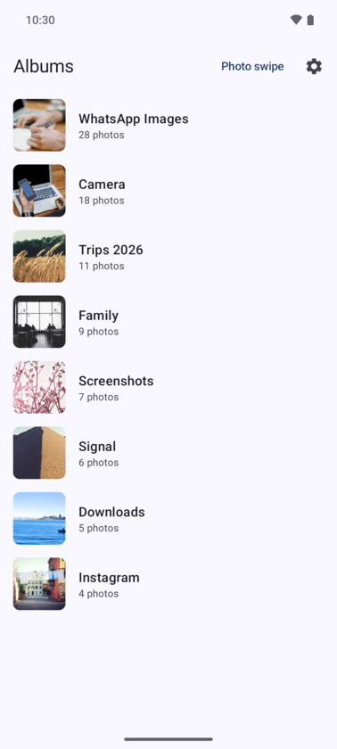
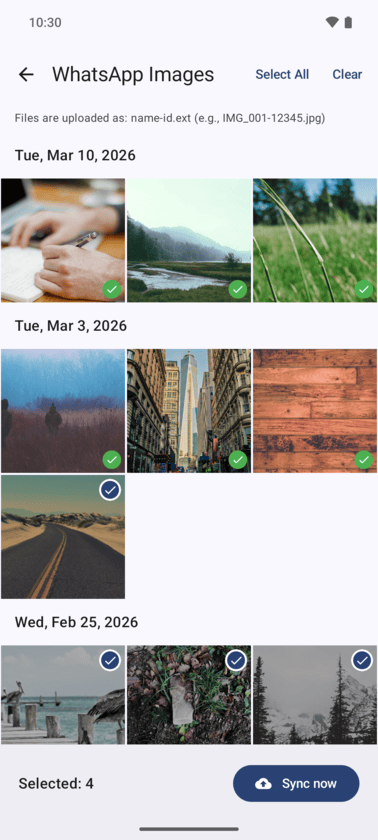
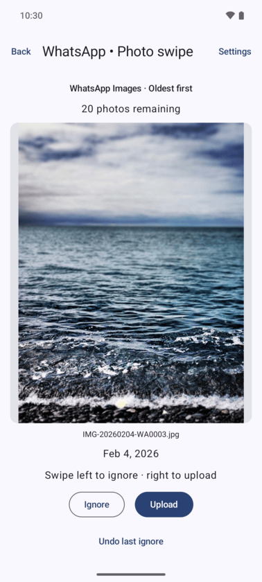
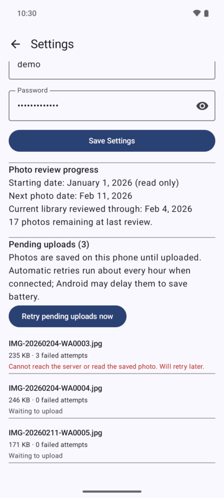

# PhotoSync

PhotoSync is an Android app for uploading photos from your phone to PhotoPrism. Browse your albums, pick several photos at once, or review WhatsApp pictures with a swipe. Your original photos stay on your phone.

You need your own PhotoPrism server and its login details. PhotoSync sends files using WebDAV (protocol used by PhotoPrism to accept uploads directly to its server).

<details>
<summary><strong>Pick photos from your albums</strong></summary>

Browse albums with cover images and photo counts. Open an album to see its photos grouped by date. Tap photos to select them, then tap **Sync now** to upload. Use **Select All** for a whole album.

Green checkmarks show photos that PhotoSync has successfully uploaded. Photos still waiting to upload do not get a green checkmark.





<details>
<summary>Photo credits</summary>

Sample photos from [Unsplash](https://unsplash.com), fetched through [Lorem Picsum](https://picsum.photos) and free to use under the [Unsplash License](https://unsplash.com/license).

Album covers, top to bottom:

- [Alejandro Escamilla](https://unsplash.com/photos/y83Je1OC6Wc)
- [Alejandro Escamilla](https://unsplash.com/photos/Dl6jeyfihLk)
- [Zugr](https://unsplash.com/photos/kmF_Aq8gkp0)
- [Adam Przewoski](https://unsplash.com/photos/umchkHwkdyM)
- [Alejandro Escamilla](https://picsum.photos/id/25/1080/2400)
- [Fabio Rose](https://unsplash.com/photos/HJSIZsC4te8)
- [Isaak Dury](https://unsplash.com/photos/YhZbnxqtooM)
- [Charles L.](https://unsplash.com/photos/5z8CIELxW1Y)

Album grid, top to bottom:

- [Alejandro Escamilla](https://unsplash.com/photos/y83Je1OC6Wc)
- [Paul Jarvis](https://unsplash.com/photos/Cm7oKel-X2Q)
- [Paul Jarvis](https://unsplash.com/photos/Ps2n0rShqaM)
- [Caleb George](https://unsplash.com/photos/zdjOYZeJj3w)
- [Matthew Wiebe](https://unsplash.com/photos/nOhUx3tiaQQ)
- [Keith Misner](https://unsplash.com/photos/h0Vxgz5tyXA)
- [Fré Sonneveld](https://unsplash.com/photos/1rZcfdsjoR4)
- [Yair Hazout](https://unsplash.com/photos/Y-eIZ3g8_ko)
- [Bartosz Bąk](https://unsplash.com/photos/4bYpcsaDhpE)
- [Sylwia Bartyzel](https://unsplash.com/photos/OdAqbedkfiA)

</details>

</details>

<details>
<summary><strong>Sort through WhatsApp photos with a swipe</strong></summary>

Tap **Photo swipe** on the Albums screen to review pictures from albums named **WhatsApp Images**, oldest first.

- **Swipe right** or tap **Upload** to add a photo to your uploads.
- **Swipe left** or tap **Ignore** to skip it. This does not delete the photo.
- Tap **Undo last ignore** to reverse your most recent skip during that session.

PhotoSync remembers your decisions so you can pick up where you left off. A remaining count shows how much is left to review. When available, it reads dates from WhatsApp filenames to help put pictures in order.

On your first review, existing photos dated before **January 1, 2026** are automatically skipped. This starting date is fixed. Older photos imported later still appear for review. You can select older photos from the album grid at any time.



<details>
<summary>Photo credits</summary>

Sample photos from [Unsplash](https://unsplash.com), fetched through [Lorem Picsum](https://picsum.photos) and free to use under the [Unsplash License](https://unsplash.com/license).

Photo by [Kundan Ramisetti](https://unsplash.com/photos/OODWPtfXAF0).

</details>

</details>

<details>
<summary><strong>Keep choosing photos while offline</strong></summary>

PhotoSync saves a copy of each queued photo in the app until it uploads. You can keep reviewing without a connection, and pending uploads survive closing the app.

Uploads run in the background when connected. Failed uploads retry about every hour, though Android may delay them to save battery. In **Settings → Pending uploads**, you can see what is waiting, read any errors, and tap **Retry pending uploads now**.

Saved copies use space on your phone and are removed after a successful upload. Keep PhotoSync installed and avoid clearing its storage while uploads are pending.



</details>

## Get started

1. Install the app using the build instructions below.
2. Open PhotoSync and allow access to your photos.
3. Tap the Settings icon on the Albums screen.
4. Enter your server's WebDAV upload address in **Base URL**, then your username and password. Tap **Save Settings**.
5. Open an album to select photos, or tap **Photo swipe** to review WhatsApp images.

Use the upload folder address supplied by whoever manages your server. The example address bundled with the app must be replaced with your own.

## Technical Stack

PhotoSync uses Kotlin and Jetpack Compose. MediaStore supplies the phone's photos, Room stores upload history and pending uploads, DataStore saves settings and review decisions, and WorkManager schedules retries. Uploads use OkHttp `PUT` requests with HTTP Basic authentication.

The main app is in [`app/`](app/). See [`CODEBASE.md`](CODEBASE.md) for an introduction to the code and Android concepts.

### Build and install

Use JDK 17, Android SDK 35, and Build Tools 35.0.0. The included Nix shell provides these on Apple Silicon macOS:

```bash
nix develop
./gradlew :app:assembleDebug
adb install -r app/build/outputs/apk/debug/app-debug.apk
```

Without Nix, configure the same tools locally and run the Gradle and ADB commands above. Enable USB debugging on the connected device to install with ADB.

Optionally copy [`.env.example`](.env.example) to `.env` and set `PHOTOSYNC_SERVER_URL` and `PHOTOSYNC_USERNAME` before building. `.env` is ignored by Git. Both values can also be changed in the app's Settings.

To update an existing installation while keeping its history, use `adb install -r` with the same application ID (`com.photoprism.uploader`) and signing certificate. Do not uninstall or clear app storage to update.

### Test with PhotoSync Lab

The `experiment` variant installs as **PhotoSync Lab**, with its own settings and data. Its records are not imported into the main app.

```bash
./gradlew :app:assembleExperiment :app:assembleExperimentAndroidTest :app:lintDebug
adb install -r app/build/outputs/apk/experiment/app-experiment.apk
adb install -r app/build/outputs/apk/androidTest/experiment/app-experiment-androidTest.apk
adb shell am instrument -w com.photoprism.uploader.experiment.test/androidx.test.runner.AndroidJUnitRunner
```

Device tests use synthetic photos and an on-device HTTP server. They cover review and undo, date boundaries, zoom gesture safety, persistent uploads, retries, cleanup, and upload checkmarks. Password visibility is checked manually and is intentionally excluded from automated tests.

For the screenshot placeholders above, use PhotoSync Lab with sample photos and test server details. Keep passwords hidden. Save the images at the suggested paths and replace each placeholder with its image.
