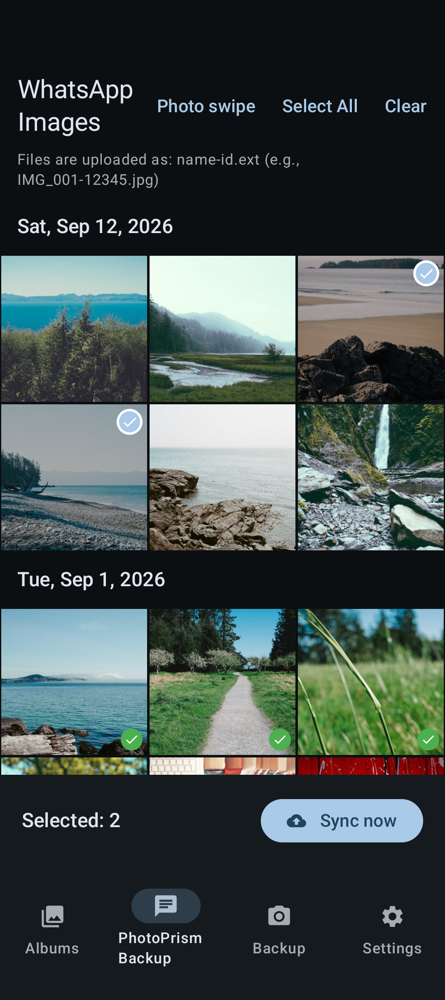
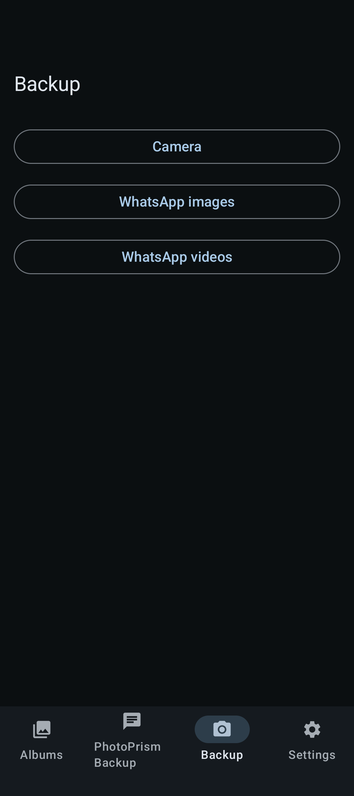
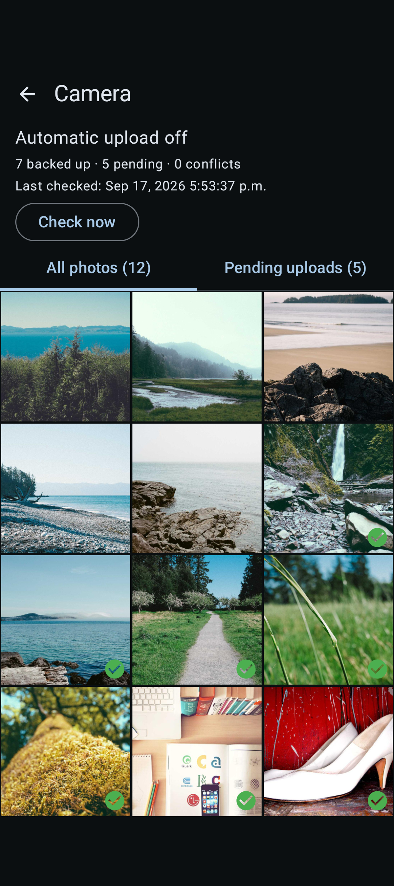

# PhotoSync

Browse your Android photo library and back up chosen photos to your own servers.
**Albums** is browse-only; **PhotoPrism Backup** offers selective WhatsApp image uploads;
**Backup** archives Camera photos, WhatsApp images, and WhatsApp videos.
Each backup workflow has independent settings, credentials and state.

## Features

<details>
<summary><strong>Browse your pictures</strong></summary>

Explore the phone's photo albums with cover images and counts. Open an album,
then tap a photo to view it and pinch or double-tap to zoom. Albums is browse-only;
use PhotoPrism Backup or Backup to upload. In larger albums, drag the right-edge
scrollbar to jump by month and year.


<details>
<summary>Photo credits</summary>

Photos from [Unsplash](https://unsplash.com) via [Lorem Picsum](https://picsum.photos),
under the [Unsplash License](https://unsplash.com/license).

- Camera cover: [Paul Jarvis](https://unsplash.com/photos/6J--NXulQCs).
- WhatsApp cover: [Paul Jarvis](https://unsplash.com/photos/gkT4FfgHO5o).

</details>

</details>

<details>
<summary><strong>Selectively back up WhatsApp images</strong></summary>

Tap photos to select them, then choose **Sync now**. Green checkmarks show upload
history; selected photos have a separate highlight. Double-tap to view and zoom.
Photos load progressively as you scroll. In larger libraries, drag the right-edge
scrollbar to jump through photos by month and year.

**Photo swipe** lets you review pictures individually: swipe right to queue an
upload, left to ignore without deleting, and undo your last ignore. Progress persists.
On first review, existing photos dated before January 1, 2026 are skipped; older
photos imported later still appear and the grid allows manual selection at any time.

Queued photos are saved privately and retried when connected, roughly hourly subject
to Android scheduling. **Settings → PhotoPrism Backup** shows pending uploads and retry
controls. Avoid clearing app storage while uploads are pending.



<details>
<summary>Photo credits</summary>

Photos from [Unsplash](https://unsplash.com) via [Lorem Picsum](https://picsum.photos),
under the [Unsplash License](https://unsplash.com/license).

Left to right, top to bottom:

1. [Paul Jarvis](https://unsplash.com/photos/6J--NXulQCs)
2. [Paul Jarvis](https://unsplash.com/photos/Cm7oKel-X2Q)
3. [Paul Jarvis](https://unsplash.com/photos/I_9ILwtsl_k)
4. [Paul Jarvis](https://unsplash.com/photos/3MtiSMdnoCo)
5. [Paul Jarvis](https://unsplash.com/photos/IQ1kOQTJrOQ)
6. [Paul Jarvis](https://unsplash.com/photos/NYDo21ssGao)
7. [Paul Jarvis](https://unsplash.com/photos/gkT4FfgHO5o)
8. [Paul Jarvis](https://unsplash.com/photos/Ven2CV8IJ5A)
9. [Paul Jarvis](https://unsplash.com/photos/Ps2n0rShqaM)
10. [Paul Jarvis](https://unsplash.com/photos/P7Lh0usGcuk)
11. [Aleks Dorohovich](https://unsplash.com/photos/nJdwUHmaY8A)
12. [Alejandro Escamilla](https://unsplash.com/photos/jVb0mSn0LbE)

</details>

</details>

<details>
<summary><strong>Back up Camera and WhatsApp media</strong></summary>

Open **Backup**, then choose **Camera**, **WhatsApp images**, or **WhatsApp videos**.
See synced checkmarks and pending filenames; upload individually or choose **Upload all**.
The date scrollbar jumps by month and year. Photos support zoom; videos open a player.
Camera includes images in `DCIM/Camera/` only. WhatsApp backups preserve subfolders.

- Automatic upload is **off by default** for each collection. Backup reuses saved results until the
  configured interval expires; **Check now** always forces a comparison. Neither uploads.
- Scheduled checks default to hourly; they upload only when automatic mode is enabled.
- Camera uses a flat archive and can also deliver uploads to PhotoPrism import.
  WhatsApp images and videos go to separate archives; selective PhotoPrism uploads
  remain independent. Original media metadata permission keeps comparisons accurate.
- Camera recognizes identical contents anywhere in its archive. WhatsApp requires
  matching contents at the same relative path. Same-name files
  with different contents require **Keep** or confirmed **Replace**; bulk/automatic
  uploads skip conflicts. Replacement overwrites the old server copy.
- Unreachable servers retain the last known status. Phone deletion never deletes a backup.





<details>
<summary>Photo credits</summary>

Photos from [Unsplash](https://unsplash.com) via [Lorem Picsum](https://picsum.photos),
under the [Unsplash License](https://unsplash.com/license).

Left to right, top to bottom:

1. [Paul Jarvis](https://unsplash.com/photos/6J--NXulQCs)
2. [Paul Jarvis](https://unsplash.com/photos/Cm7oKel-X2Q)
3. [Paul Jarvis](https://unsplash.com/photos/I_9ILwtsl_k)
4. [Paul Jarvis](https://unsplash.com/photos/3MtiSMdnoCo)
5. [Paul Jarvis](https://unsplash.com/photos/IQ1kOQTJrOQ)
6. [Paul Jarvis](https://unsplash.com/photos/NYDo21ssGao)
7. [Paul Jarvis](https://unsplash.com/photos/gkT4FfgHO5o)
8. [Paul Jarvis](https://unsplash.com/photos/Ven2CV8IJ5A)
9. [Paul Jarvis](https://unsplash.com/photos/Ps2n0rShqaM)
10. [Paul Jarvis](https://unsplash.com/photos/P7Lh0usGcuk)
11. [Aleks Dorohovich](https://unsplash.com/photos/nJdwUHmaY8A)
12. [Alejandro Escamilla](https://unsplash.com/photos/jVb0mSn0LbE)

</details>

</details>

## Build and get started

Use JDK 17, Android SDK 35 and Build Tools 35.0.0, or the included Nix environment:

```sh
nix develop --command ./gradlew :app:assembleDebug :app:lintDebug
adb install -r apps/android/build/outputs/apk/debug/app-debug.apk
```

Back up an existing installation before updating. Keep its signing key and app ID,
and use `install -r` to preserve state.

In the **Settings** tab, configure **PhotoPrism Backup** with a PhotoPrism/WebDAV upload URL
and login. For **Backup**, [deploy the Camera service](services/camera/README.md#deployment)
using the root `.env.example` and Compose file, then enter its HTTPS URL and token.

## Development

Android lives in `apps/android/` (Gradle module `:app`), and the Python Camera API
in `services/camera/`. Root Compose runs the API behind an HTTPS gateway.

- [Android maintenance and tests](apps/android/README.md)
- [Camera deployment, logs and protocol](services/camera/README.md)
- [Known limitations](issues.md)
